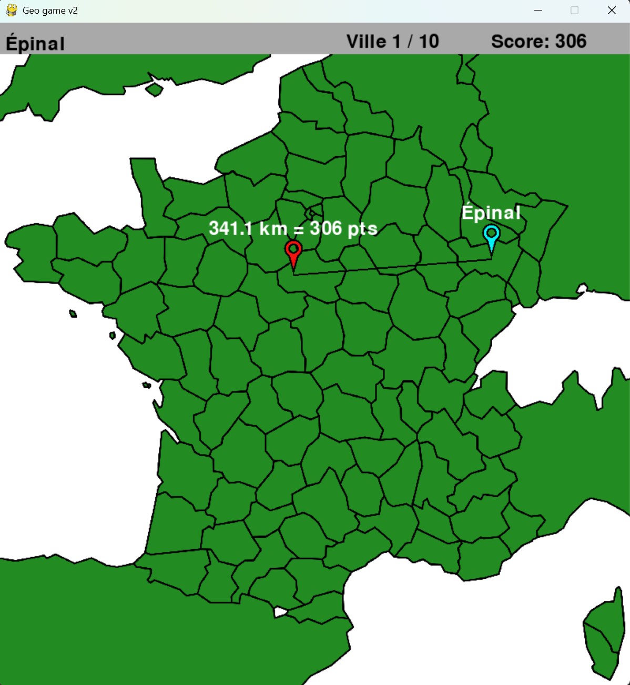

# GeoGame

## Principe du jeu
- Le but du jeu est de placer correctement les villes demandées sur la carte en cliquant sur leur emplacement.
- Un score est attribué en fonction de la distance entre le clic et l'emplacement réel de la ville (le plus proche est le mieux)
- Une partie se joue en 10 round




## Installation
```
git clone https://github.com/tfoutelrodier/GeoGame
python GeoGame/main.py 
```

## Origine du projet

Les jeux de géographie éducatifs (en particulier seterra.com) m'ont aidé à apprendre la géographie française, un domaine que j'ai longtemps négligé.
Je me suis apperçu que la pluspart des jeux ne permettaient pas de customiser les villes selon mes envies et se limitaient souvent aux préfectures départementales. 

Je me suis donc dit que ce serait un projet amusant de créer ce jeu moi même. Cela me permettait aussi de m'entrainer avec des données GPS ainsi qu'une interface comme pygame.

## Données
- Les données GPS sont celles des unités territoriales européennes (les NUPS) ce qui explique pourquoi la Suisse et Andorre n'apparaissent pas en vert (pour le moment). 
Elles sont trouvable sur https://www.data.gouv.fr/fr/datasets/villes-de-france/#/community-resources (données de septembre 2022)
- Les villes selectionnées correspondent pour le moment aux deux villes les plus peuplées de chaque département
- Les données sources des NUPS et les fichiers intermédiaires ayant permis de générer le fichier cities_data.csv ne sont pas stockés mais le code est présent pour les regénérer.
- Le calcul du score en fonction de la distance est le même que pour le jeu geoguesser, adapté pour la France métropolitaine.

## Futur développement
Le jeu est actuellement dans un état jouable qui me suffit pour apprendre mais il manque encore clairement de finition sur ces aspects graphiques et sur l'organisation des fichiers. 

Je prévois de revenir dessus lorsque j'implémenterai un système de mode de jeu pour choisir le set de villes avec lequel jouer.